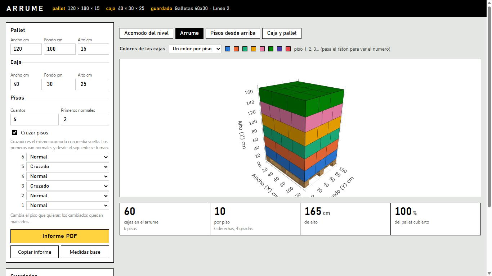
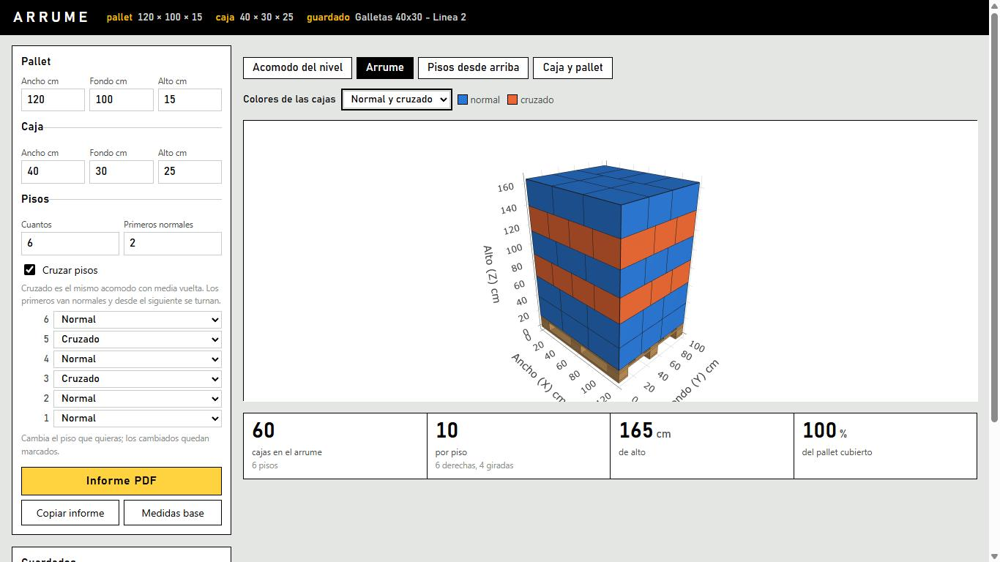
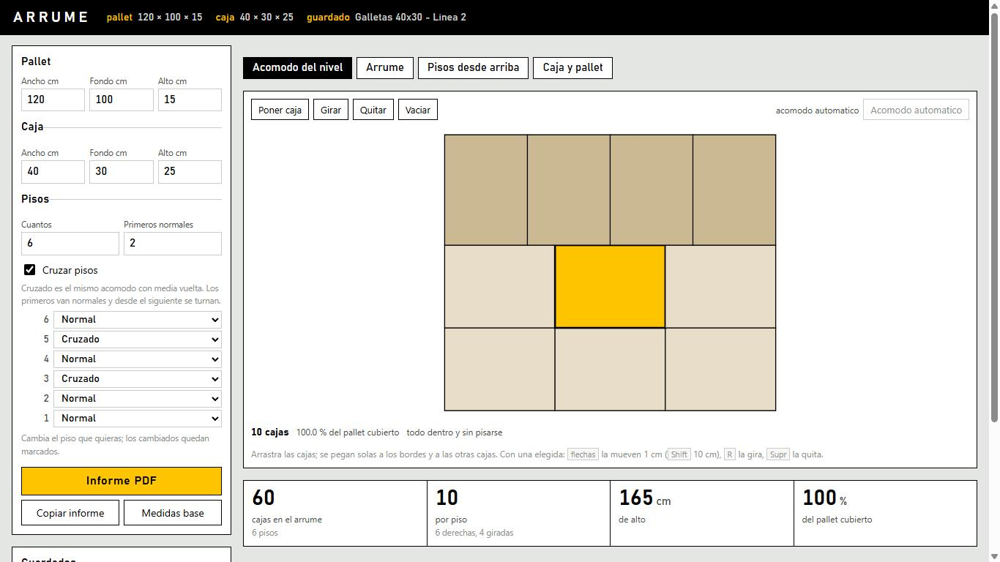
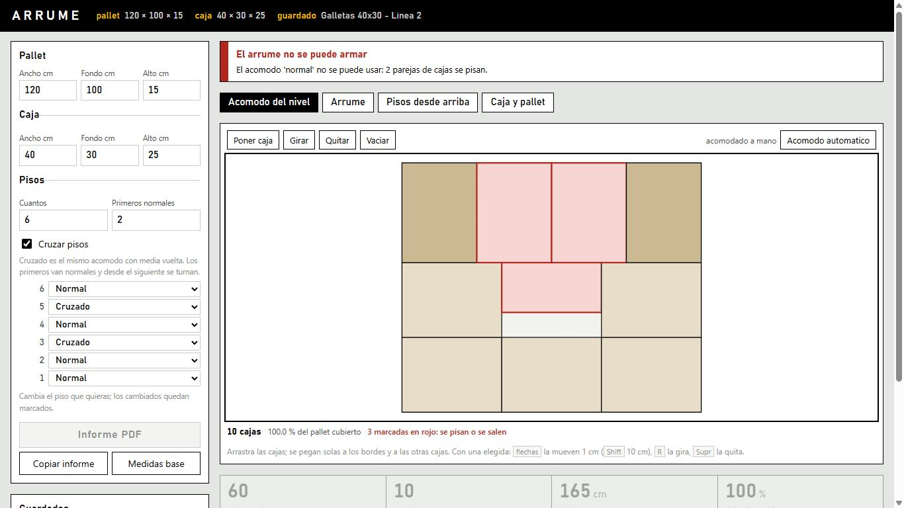
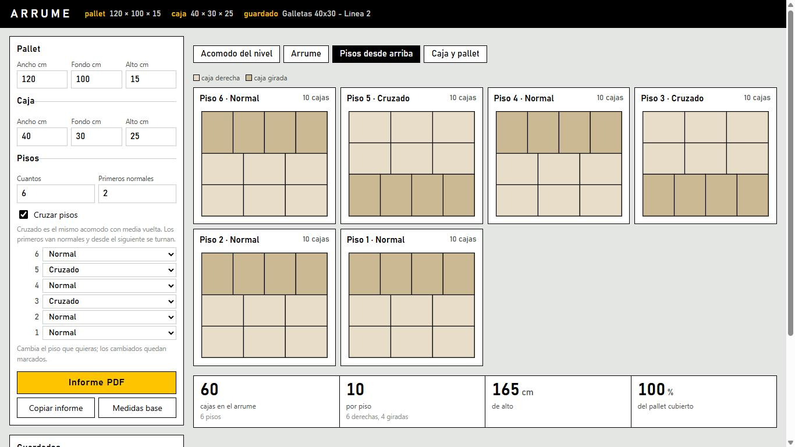
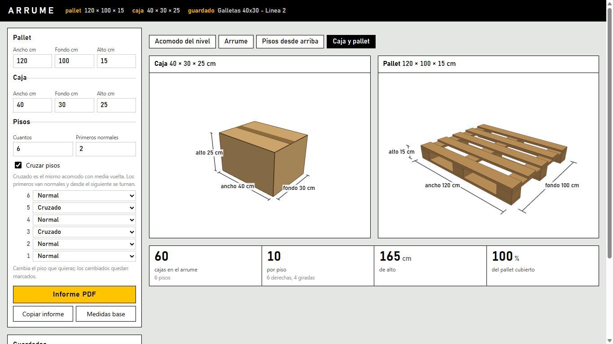
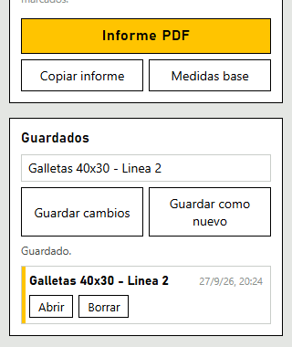
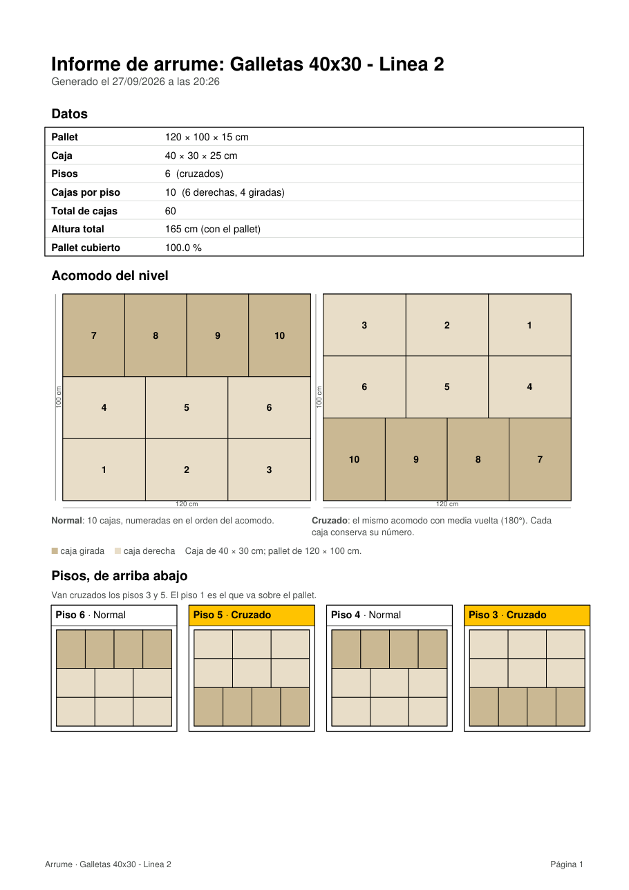
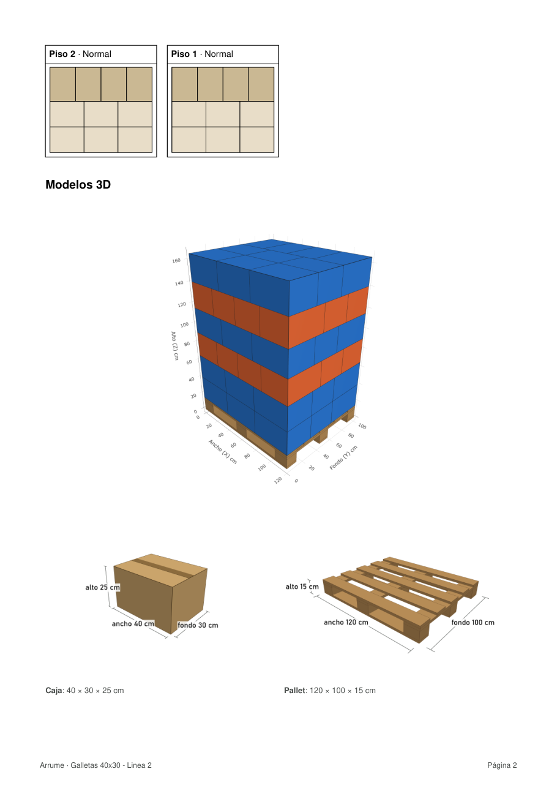
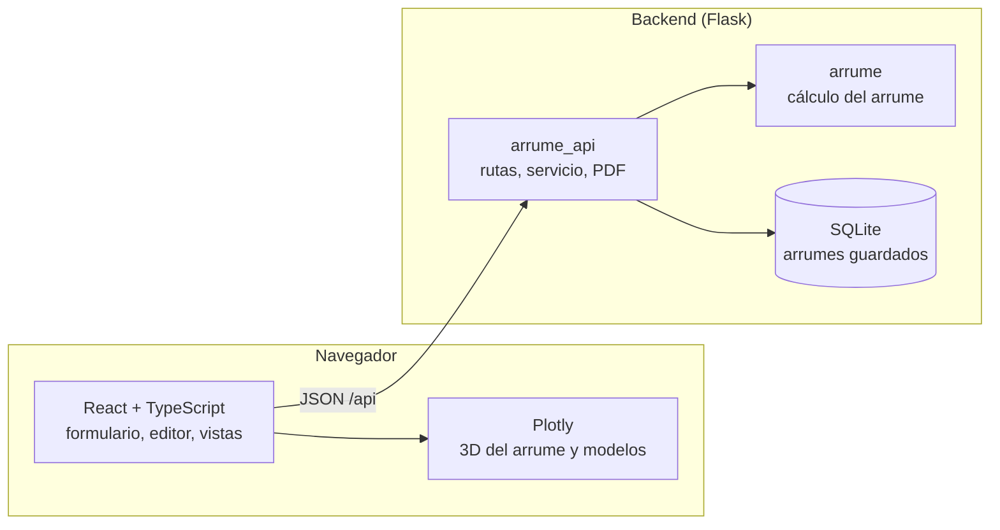

# Arrume

Aplicación web para diseñar, visualizar y documentar arrumes de cajas sobre pallets (*pallet loading*).

Se ingresan las medidas del pallet y de la caja, se define a mano cómo van las cajas en un nivel y se indica, piso por piso, si ese nivel va **normal** o **cruzado**. La aplicación arma el arrume completo, lo dibuja en 3D, muestra cada piso visto desde arriba, genera los modelos 3D acotados de la caja y del pallet, guarda los arrumes en una base de datos y produce un informe en PDF listo para imprimir.



---

## Contenido

- [Funcionalidades](#funcionalidades)
- [Capturas](#capturas)
- [Arquitectura](#arquitectura)
- [Tecnologías](#tecnologías)
- [Requisitos](#requisitos)
- [Instalación](#instalación)
- [Uso](#uso)
- [Desarrollo](#desarrollo)
- [Configuración](#configuración)
- [API](#api)
- [Persistencia](#persistencia)
- [Informe PDF](#informe-pdf)
- [Validaciones y límites](#validaciones-y-límites)
- [Estructura del proyecto](#estructura-del-proyecto)
- [Pruebas e integración continua](#pruebas-e-integración-continua)
- [Limitaciones conocidas](#limitaciones-conocidas)

---

## Funcionalidades

| Área | Qué hace |
| --- | --- |
| **Medidas** | Ancho, fondo y alto del pallet y de la caja, en centímetros. Admite decimales con punto o coma. |
| **Acomodo del nivel** | Editor visual para ubicar cada caja: arrastrar con imanes a bordes y cajas vecinas, girar, agregar en el primer hueco libre, quitar y mover con el teclado. Parte de un acomodo calculado automáticamente (el que más cajas mete). |
| **Pisos** | Cantidad de pisos y, para cada uno, si va *normal* o *cruzado* (el mismo acomodo con media vuelta). Regla rápida para cruzar desde un piso dado ("primeros normales") y ajuste individual por piso. |
| **Vista 3D** | Arrume completo sobre un pallet de bloques, con rotación libre, descarga como imagen y cuatro esquemas de color para las cajas. |
| **Pisos desde arriba** | La planta de cada piso, diferenciando cajas derechas y giradas. |
| **Caja y pallet** | Modelos 3D de la caja (con su cinta) y del pallet (tablas, travesaños y tacos), generados con las medidas ingresadas y acotados. |
| **Guardados** | Crear, abrir, actualizar y borrar arrumes con nombre, en SQLite. |
| **Informe PDF** | Datos del arrume, acomodo numerado (normal y cruzado), cada piso de arriba abajo con los cruzados resaltados, y los modelos 3D del arrume, la caja y el pallet. |

---

## Capturas

### Vista 3D del arrume

El arrume completo sobre el pallet, con las cifras principales debajo. El selector *Colores de las cajas* ofrece cuatro esquemas: un color por piso, normal y cruzado, cartón, o un solo color a elección.


Con el esquema *Normal y cruzado* se ve de un vistazo qué pisos van cruzados:



### Editor del acomodo

Las cajas se arrastran sobre el plano del pallet y se pegan solas a los bordes y a las cajas vecinas. La caja elegida se resalta y se puede girar (`R`), quitar (`Supr`) o mover con las flechas (1 cm, o 10 cm con `Shift`).



Las cajas que se pisan o se salen del pallet se marcan en rojo al instante, el backend explica el problema y el arrume no se arma hasta corregirlo:



### Pisos desde arriba

Cada piso visto desde arriba, de arriba abajo, indicando si va normal o cruzado.



### Caja y pallet

Modelos 3D acotados de la caja y del pallet, construidos con las medidas del formulario.



### Guardados e informe



Informe PDF generado para el arrume guardado:

| Página 1 | Página 2 |
| --- | --- |
|  |  |

---

## Arquitectura

Frontend y backend son dos proyectos independientes que se comunican exclusivamente por una API JSON.



- **`arrume`** es el núcleo de cálculo: modelos del dominio, motor de empaquetado, pisos normales y cruzados, apilado e informe. No depende de Flask, de la base de datos ni del navegador.
- **`arrume_api`** es el adaptador web: traduce JSON al dominio y de vuelta, guarda en SQLite detrás de un protocolo de repositorio y genera el PDF.
- **El frontend** mantiene el estado de la página, dibuja el editor y las plantas en SVG y el 3D con Plotly. El backend envía la posición de cada caja; cómo se dibuja lo decide el frontend.

En producción Flask sirve también el build de React, de modo que la aplicación es un único proceso. En desarrollo cada parte corre por separado.

---

## Tecnologías

| Capa | Tecnología |
| --- | --- |
| Backend | Python 3.10 o superior, Flask 3, SQLite (`sqlite3` de la biblioteca estándar), reportlab 4 o superior |
| Frontend | React 19, TypeScript 7, Vite 8, Plotly.js 4 |
| Calidad | pytest, hypothesis, ruff, mypy, Vitest |
| Integración continua | GitHub Actions |

---

## Requisitos

- Python 3.10 o superior
- Node.js 24 o superior, con npm
- Un navegador moderno con WebGL (para las vistas 3D)

---

## Instalación

```bash
git clone <url-del-repositorio> arrume
cd arrume

# Backend
python -m venv .venv
.venv/Scripts/python -m pip install -e "backend[dev]"      # Linux/macOS: .venv/bin/python

# Frontend
cd frontend
npm install
npm run build
```

---

## Uso

### En Windows, con doble clic

Ejecutar `Arrume.bat`. La primera vez compila la página si hace falta (requiere Node.js). Luego inicia el programa en una ventana minimizada y abre el navegador en `http://127.0.0.1:5000/`. Cerrar esa ventana detiene la aplicación.

### Desde la terminal

```bash
.venv/Scripts/python -m arrume_api --abrir          # en http://127.0.0.1:5000/
.venv/Scripts/python -m arrume_api --puerto 8080    # otro puerto
```

### Flujo de trabajo

1. Ingresar las medidas del pallet y de la caja.
2. En **Acomodo del nivel**, ajustar la ubicación de las cajas o dejar el acomodo automático.
3. En **Pisos**, fijar la cantidad y cuáles van cruzados.
4. Revisar el resultado en **Arrume**, **Pisos desde arriba** y **Caja y pallet**.
5. Guardar el arrume con un nombre y descargar el **Informe PDF**.

---

## Desarrollo

Cada parte en su propia terminal:

```bash
# Backend: API en http://127.0.0.1:5000
cd backend
../.venv/Scripts/python -m arrume_api

# Frontend: página en http://localhost:5173, con recarga en caliente
cd frontend
npm run dev
```

Vite reenvía las peticiones a `/api` hacia el backend, así que el navegador ve un solo origen y no hace falta configurar CORS durante el desarrollo.

---

## Configuración

El backend se configura con variables de entorno:

| Variable | Descripción | Valor por defecto |
| --- | --- | --- |
| `ARRUME_BD` | Archivo SQLite de los arrumes guardados | `backend/instance/arrume.sqlite3` |
| `ARRUME_FRONTEND` | Carpeta del build de React que Flask sirve en `/` | `frontend/dist` |
| `ARRUME_ORIGENES` | Orígenes autorizados a llamar a la API desde otro dominio (CORS), separados por comas | vacío |

Si el frontend se publica en un dominio distinto al del backend, se compila indicando la dirección de la API y se autoriza ese origen:

```bash
VITE_API=https://api.ejemplo.com npm run build
ARRUME_ORIGENES=https://arrume.ejemplo.com
```

---

## API

Todas las rutas reciben y devuelven JSON, salvo el informe, que devuelve un PDF.

| Método | Ruta | Descripción |
| --- | --- | --- |
| `POST` | `/api/calcular` | Arma el arrume y devuelve cifras, avisos, geometría 3D, acomodo usado y planta de cada piso |
| `GET` | `/api/valores-iniciales` | Valores con los que abre el formulario |
| `GET` | `/api/arrumes` | Arrumes guardados, del más reciente al más antiguo (sin sus datos) |
| `POST` | `/api/arrumes` | Guarda un arrume: `{nombre, datos}` |
| `GET` | `/api/arrumes/<id>` | Un arrume guardado, con sus datos |
| `PUT` | `/api/arrumes/<id>` | Reemplaza nombre y datos |
| `DELETE` | `/api/arrumes/<id>` | Borra el arrume |
| `POST` | `/api/informe` | Informe en PDF: `{datos, nombre?, imagen_3d?, imagen_caja?, imagen_pallet?}` |

### Ejemplo

```http
POST /api/calcular
Content-Type: application/json

{
  "pallet_ancho": 120, "pallet_profundidad": 100, "pallet_alto": 15,
  "caja_ancho": 40, "caja_profundidad": 30, "caja_alto": 25,
  "niveles": 6,
  "pisos": ["normal", "normal", "cruzado", "normal", "cruzado", "normal"],
  "acomodo": [{"x": 0, "y": 0, "ancho": 40, "profundidad": 30}]
}
```

- `pisos` es opcional. Si falta, se calcula a partir de `cruzar` (booleano) e `iguales` (cantidad de primeros pisos normales).
- `acomodo` es opcional. Si falta, el backend calcula el acomodo que más cajas mete y lo devuelve en la respuesta, para que el editor parta de él.

Respuesta (resumida):

```json
{
  "ok": true,
  "resumen": { "cajas_por_nivel": 1, "total_cajas": 6, "altura_total": 165, "aprovechamiento": 10.0 },
  "pallet": { "ancho": 120, "profundidad": 100, "alto": 15 },
  "cajas": [{ "x": 0, "y": 0, "z": 15, "ancho": 40, "profundidad": 30, "alto": 25, "nivel": 0 }],
  "plantas": [{ "forma": "normal", "cajas": [{ "x": 0, "y": 0, "ancho": 40, "profundidad": 30 }] }],
  "acomodo": [{ "x": 0, "y": 0, "ancho": 40, "profundidad": 30 }],
  "avisos": [],
  "texto": "Pallet .............. 120 x 100 x 15 cm ..."
}
```

### Códigos de respuesta

| Código | Significado |
| --- | --- |
| `200` | Correcto. En `/api/calcular`, un dato inválido también responde 200 con `{"ok": false, "error": "..."}`, para que la página lo muestre en su lugar. |
| `201` | Arrume guardado. |
| `204` | Arrume borrado. |
| `400` | El cuerpo no es un objeto JSON. |
| `404` | El arrume o la ruta no existen. |
| `422` | Los datos no permiten armar el arrume (no se guarda ni se genera el PDF). |

Todas las respuestas de error bajo `/api` son JSON con la forma `{"error": "mensaje"}`.

---

## Persistencia

Los arrumes se guardan en una única tabla SQLite:

| Columna | Tipo | Contenido |
| --- | --- | --- |
| `id` | `INTEGER` | Clave primaria autoincremental |
| `nombre` | `TEXT` | Nombre dado por el usuario (hasta 100 caracteres) |
| `datos` | `TEXT` | JSON con medidas, pisos y acomodo |
| `creado` | `TEXT` | Fecha de creación, ISO 8601 en UTC |
| `actualizado` | `TEXT` | Fecha de la última modificación, ISO 8601 en UTC |

Se guarda lo que ingresó el usuario, no el resultado: al abrir un arrume se vuelve a calcular. Solo se guardan arrumes que se pueden armar, por lo que todo lo guardado siempre se vuelve a abrir.

Las rutas acceden a la base a través del protocolo `RepositorioArrumes`; cambiar de motor de base de datos consiste en escribir otra clase que lo cumpla.

---

## Informe PDF

El informe se genera en el backend con reportlab. Los planos son vectoriales y se imprimen nítidos a cualquier tamaño. Las imágenes 3D las genera el navegador y las envía junto con la petición; si no pueden generarse (por ejemplo, sin WebGL), el informe se emite igual sin ellas.

Contenido:

1. **Datos**: pallet, caja, cantidad de pisos, cajas por piso (derechas y giradas), total, altura total y superficie cubierta.
2. **Acomodo del nivel**: acomodo normal y cruzado con las cajas numeradas y las cotas del pallet.
3. **Pisos, de arriba abajo**: la planta de cada piso, con los cruzados resaltados.
4. **Modelos 3D**: el arrume con el esquema de color elegido, la caja y el pallet acotados.

El nombre del archivo se deriva del nombre del arrume, por ejemplo `arrume-galletas-40x30-linea-2.pdf`.

---

## Validaciones y límites

- Todas las medidas deben ser números positivos y finitos. Los errores se informan en lenguaje llano, indicando el campo.
- El acomodo manual se valida en el navegador mientras se edita y en el backend antes de armar el arrume: ninguna caja puede salirse del pallet, encimarse con otra ni tener medidas distintas a las de la caja.
- **Hasta 100 pisos y 300 cajas por piso.** Por encima de eso el cálculo y el dibujo dejan de ser ágiles, y ningún arrume real se acerca a esos valores. El tope se comprueba antes de calcular, por lo que una medida a medio escribir (por ejemplo, una caja de 1 cm) se rechaza al instante.
- **Cálculo del acomodo automático.** El motor usa cortes guillotina para buscar el acomodo que más cajas mete. Con cajas pequeñas la cantidad de cortes posibles se dispara; en ese caso se usa un método rápido de dos bloques uniformes, que responde en menos de medio segundo y en los casos medidos pierde como máximo el 1 % de las cajas.

---

## Estructura del proyecto

```
.
├── Arrume.bat                  Lanzador para Windows
├── backend/
│   ├── pyproject.toml
│   ├── arrume/                 Núcleo de cálculo, sin web ni base de datos
│   │   ├── domain/             Modelos (Pallet, Caja, Arrume...) y errores
│   │   ├── packing/            Motor de empaquetado y validación de acomodos
│   │   ├── pisos.py            Pisos normales y cruzados
│   │   ├── stacking.py         Apilado de pisos y armado del arrume
│   │   └── reporting.py        Cifras, avisos e informe en texto
│   ├── arrume_api/             Adaptador web
│   │   ├── app.py              Fábrica de la aplicación Flask y configuración
│   │   ├── rutas.py            Rutas /api
│   │   ├── servicio.py         Conversión entre JSON y dominio
│   │   ├── repositorio.py      Protocolo de persistencia e implementación SQLite
│   │   └── informe_pdf.py      Informe en PDF
│   └── tests/
├── frontend/
│   ├── package.json
│   ├── vite.config.ts
│   └── src/
│       ├── App.tsx             Estado de la página y llamadas a la API
│       ├── api.ts              Cliente de la API
│       ├── componentes/        Formulario, editor, vistas 3D, plantas, guardados
│       └── logica/             Reglas puras con sus pruebas: pisos, editor,
│                               colores, modelos 3D e imágenes del informe
├── docs/capturas/              Imágenes de este documento
└── .github/workflows/ci.yml    Integración continua
```

---

## Pruebas e integración continua

```bash
# Backend
cd backend
ruff check .      # estilo, imports y errores comunes
mypy              # tipos de arrume y arrume_api
pytest            # 318 pruebas

# Frontend
cd frontend
npm test          # 43 pruebas (Vitest)
npm run build     # verificación de tipos y build de producción
```

Las pruebas del backend cubren las invariantes del acomodo (ninguna caja fuera del área ni encimada, totales coherentes), los pisos normales y cruzados, el servicio, todas las rutas de la API con una base SQLite temporal, el informe PDF y los tiempos de respuesta del motor. Las del frontend cubren la lógica del editor, los pisos, los colores y los modelos 3D.

GitHub Actions ejecuta en cada push y pull request:

- **Backend**: ruff, mypy y pytest con Python 3.10, 3.12 y 3.13.
- **Frontend**: pruebas con Vitest y build con Node.js 24.

---

## Limitaciones conocidas

- El servidor incluido es el de desarrollo de Flask, pensado para uso local. Para publicarlo en internet se requiere un servidor WSGI (por ejemplo gunicorn o waitress) y autenticación, ya que la API no pide usuario.
- El pallet se modela siempre como un pallet de bloques tipo europallet. Otros tipos se pueden agregar en `piezasPallet` (`frontend/src/logica/modelos3d.ts`).
- El piso cruzado se define como el acomodo normal girado 180 grados.
- La interfaz está en español y las medidas en centímetros.
